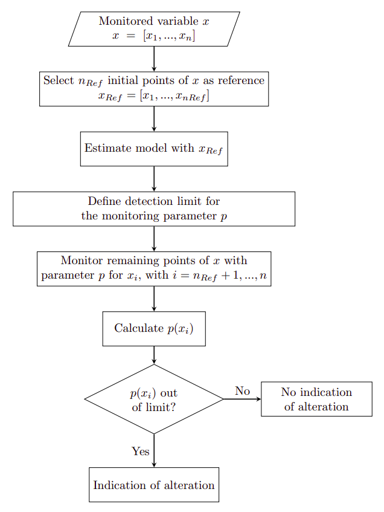
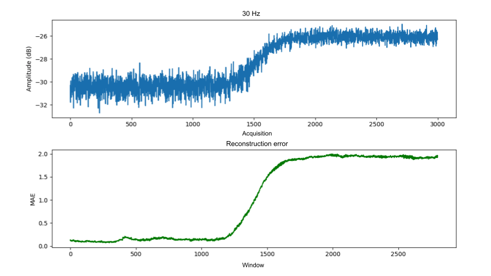

# MsC-codes


Algorithms implemented for my Master's in electrical engineering focused on fault detection in synchronous generators through statistical and machine learning techniques. The main goal was to detect changes in the harmonic component's amplitudes of the machine's external magnetic field. Using synthetic and experimental data, the harmonics' amplitudes were monitored in order to identify alterations, that could be related to an incipient fault in the generator. More details can be found [here](https://repositorio.ufsc.br/handle/123456789/229780) (in Portuguese).

## Basic principle

The variables monitored are the harmonics from the external magnetic field (the stored amplitudes of each harmonic). The basic algorithm is similar for all the techniques and is illustrated in the flowchart below.



For each *x* variable with *n* acquisitions (*n* points), a model for the healthy behavior is obtained, considering *nref* initial points. It is assumed that the initial points of the variable are healthy, (*i.e.*, there is no fault in the generator during the initial acquisitions). From this model, the monitoring parameter *p*, related to each technique, and its reference healthy value are obtained. With this reference value a detection limit is set. For all the other acquisitions, the parameter *p* is calculated and monitored according to the limit set. If it is off limit, there is an indication of alteration in the variable, which can be related to an incipient fault in the generator. If it is within the limit, there is no indication of alteration and it is assumed that the behavior of the variable is similar to the healthy condition.


## Techniques

Six techniques were applied and evaluated.

### 1. Anomaly detection with PDFs

A PDF (Probability Density Function) describes the relative probability of a random variable to present a given value. For condition monitoring, the PDF for healthy data is calculated and new data is monitored in relation to this reference distribution. Changes in the monitored variable that result in changes in its probability density are considered anomalies.

### 2. KLD

Kullback-Leibler Divergence (KLD) or relative entropy, is a measure of the difference between 2 PDFs. For the detection of changes in a variable, a reference PDF is estimated with healthy points. Obtaining PDFs for new points, the value of KLD can be used to compare these 2 PDFs. In case there is a fault or other phenomena that alters the monitored variable, KLD values tend to alter as well.

### 3. PCA

PCA (Principal Component Analysis) is a technique used for dimensionality reduction, data compression, feature extraction and data visualization. Its main idea is to reduce the dimensions of a dataset composed of related variables, conserving in the new dataset the maximum variation observed in the original data. The original data is linearly projected into a lower dimension space in a way that the variance is maximized. For alteration or fault detection in a dataset, 2 parameters can be used: *SPE* and *T²*. *SPE* (Squared Prediction Error) is a measure of how much the projected data in the principal components space differs from the data in the original space. T² (or Hotelling’s T²) is related to the projected data and is used to evaluate the variations of the principal components. Both of these parameters will indicate if there is an alteration in the dataset as a whole. To get the information of which variables in the dataset that presented an alteration, it is necessary to calculate the contribution of each variable to *SPE* and T².


### 4. SSA

SSA (Singular-Spectrum Analysis) is a time series decomposition technique. The components extracted with SSA can be interpreted as trend, periodicity and noise. For condition monitoring there are 2 parameters that can be used. One of them is a type of distance related to this technique. The other one is a measure of the differences between reconstructed time series.

### 5. EMD and energy analysis

EMD (Empirical Mode Decomposition) is also a time series decomposition technique. Its main idea is to extract a finite number of IMFs (Intrinsic Mode Functions) from a signal, which is done through an iterative process. For condition monitoring, each IMF can be analyzed in order to detect an alteration in the signal. The energy of the IMFs can also be analyzed. Using EMD did not result in a good parameter for condition monitoring for this application. Only the energy analysis of the signal, without EMD, resulted in a good monitoring parameter.

### 6. Autoencoders

An autoencoder is a neural network trained to reconstruct input data. This network is composed of an encoder, that learns a compressed representation of the input data, and a decoder, that reconstructs the compressed data. For alteration detection in a variable, the mean absolute error (MAE), or reconstruction error, can be utilized as a monitoring parameter. It is expected that a network trained with healthy data will reconstruct this type of data with a low MAE. In case there is an alteration in the behavior of the variable, it is expected that MAE will increase, allowing for its use as a detection parameter.

## Example

In the data folder there is a file of one of the synthetic data used. Each column represents an harmonic and each row is one acquisition, resulting in the amplitudes values of the harmonics for each acquisition. In the synthetic data, 135 harmonics were analyzed. In these data there is the simulation of a rotor fault in the synchronous generator beginning at acquisition number 1000, and slowly increasing until acquisition number 2000. There is a total of 3000 acquisitions.

As an example, below there is one harmonic identified as altered using an autoencoder. There is an increase in the harmonic's amplitude values, which can be detected using the monitoring parameter of this technique, the reconstruction error (or MAE). By setting a limit for this parameter, it was possibly to identify harmonics with alteration.




## Usage

To execute any of the codes it is necessary to use Python 3. To install all the required libraries execute:


```python
pip install -r requirements.txt
```

 ### Files

- **main.py**

Main code that process the data and calls all the techniques algorithms. It processes all *.txt* files in the defined directory. After some preprocessing functions, there are the functions for each technique. For each dataset with multiple harmonics and its amplitudes, each function returns which one of the harmonics presented an alteration. I recommend to execute one technique at a time and comment out the others.

- **anomaly_pdf.py**

- **autoencoder.py**
- **emd.py**
- **energy.py**
- **kld.py**
- **pca.py**
- **ssa.py**


## Author

Marjorie Hoegen.
